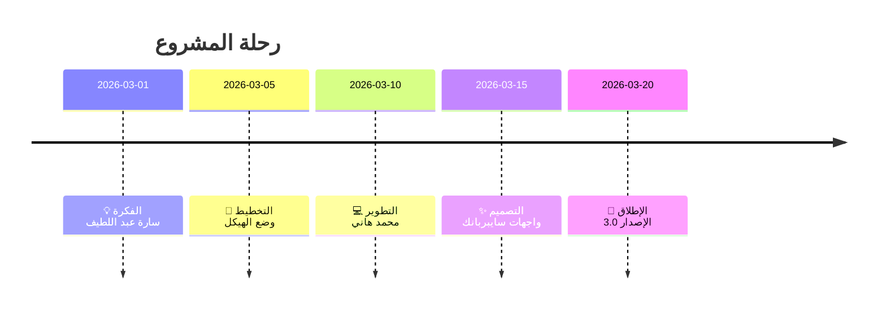
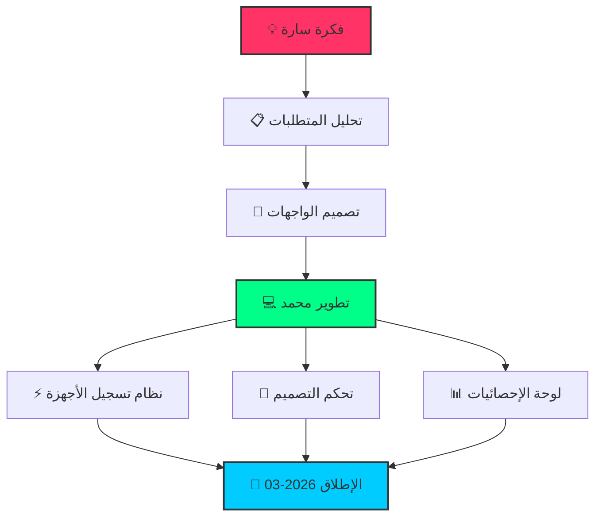

<div align="center">
  
  # ⚡ CYBER NETWORK SECURITY SYSTEM
  
  
  
  <br>
  
  
  
  
  
  <br>
  
</div>

## 📋 نظرة عامة

نظام متكامل لمراقبة وإدارة الأجهزة على الشبكة المحلية، بواجهة مستخدم عصرية بتصميم سايبربانك.

### ✨ المميزات الرئيسية
- 📱 تسجيل تلقائي للأجهزة الزائرة
- 🎨 تحكم كامل في ألوان وتصميم الموقع
- 📊 إحصائيات مباشرة للأجهزة النشطة
- 🔒 نظام حماية متكامل للشبكة
- 🌙 وضع سايبربانك للتأثيرات البصرية

<br>

<br>

## 🎯 قصة المشروع



<br>

<br>

## 👥 فريق العمل

<div align="center">
  
| | |
|:---:|:---:|
| **👨‍💻 Mohamed Hany** | **👩‍🎨 Sara Abdelatif** |
| **المبرمج والمطور** | **صاحبة الفكرة** |
|  |  |
| تنفيذ الكود والتطوير | وضع الفكرة ورسم الخريطة |

</div>

<br>

## 🗺️ خريطة الفكرة



<br>

<br>

## 🚀 طريقة التشغيل

```bash
# 1. تثبيت المتطلبات
pip install flask

# 2. تشغيل السيرفر
python server.py

# 3. فتح المتصفح
# الصفحة الرئيسية: http://localhost:5000
# لوحة التحكم: http://localhost:5000/dashboard
```

<br>

## 📁 هيكل المشروع

```
📁 Internet-Server/
├── 📄 server.py                 # السيرفر الرئيسي
├── 📄 site_config.json          # ملف الإعدادات
├── 📁 templates/                 # قوالب HTML
│   ├── 📄 index.html            # الصفحة الرئيسية
│   └── 📄 dashboard.html        # لوحة التحكم
└── 📄 README.md                 # هذا الملف
```

<br>

<br>

## 🌐 نقاط الوصول

| المسار | الوصف |
|--------|-------|
| `/` | الصفحة الرئيسية - عرض الشبكة |
| `/dashboard` | لوحة التحكم - التحكم الكامل |
| `/api/dashboard/stats` | API الإحصائيات |
| `/api/dashboard/devices` | API قائمة الأجهزة |

<br>

## ⚙️ إعدادات التصميم

```yaml
theme:
  primary_color: "#00ff88"     # أخضر نيون
  secondary_color: "#ff3366"   # وردي
  bg_color: "#0a0a0a"          # خلفية سوداء
  card_bg: "#1a1a1a"           # بطاقات
  text_color: "#ffffff"        # نص أبيض
  glow_effect: true            # تأثير التوهج
  cyberpunk_mode: false        # وضع سايبربانك
```

<br>

<br>

## 📊 إحصائيات المشروع

| العنصر | القيمة |
|--------|--------|
| 📅 تاريخ الإصدار | مارس 2026 |
| ⏱️ مدة التطوير | 20 يوم |
| 📝 سطور الكود | +1500 |
| 🎨 عدد الألوان | 6 أساسية |
| 📱 الأجهزة المدعومة | جميعها |

<br>

## 🔗 روابط

<div align="center">
  
[](https://github.com/TechOrbit-Official)
[](mailto:sara.abdelatif@techorbit.com)

</div>

<br>

<br>

## 📜 الحقوق

```text
⚡══════════════════════════════════════════════════════════════════╡
                                                                     
  © 2026 Cyber Network Security System                              
                                                                     
  👨‍💻 Developer   : Mohamed Hany                                     
  💡 Idea Owner  : Sara Abdelatif                                    
  📅 Release Date: March 2026                                        
                                                                     
  جميع الحقوق محفوظة لفريق العمل                                    
                                                                     
⚡══════════════════════════════════════════════════════════════════╡
```

<br>

<div align="center">
  
## ⚡ تم التطوير بـ ❤️ بواسطة Mohamed Hany ⚡

**💡 فكرة Sara Abdelatif | 🚀 إصدار مارس 2026**


**🌐 Cyber Network Security v3.0**

</div>
