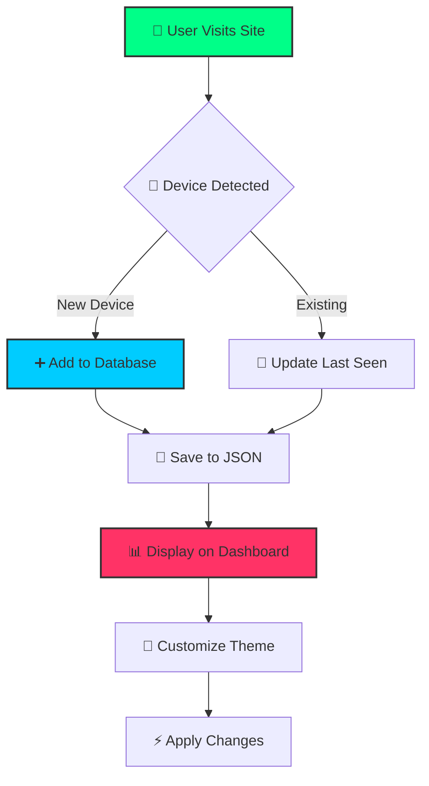
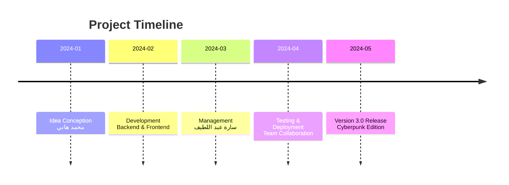

<div align="center">
  
  # 🌐 CYBER NETWORK SECURITY SYSTEM
  
  
  
  <br>
  
  
  
  
  
  
  
  <br>
  
  
  
</div>

## 📋 TABLE OF CONTENTS

| Section | Description |
|---------|-------------|
| [✨ Features](#-features) | المميزات الرئيسية |
| [🎨 Design Control](#-design-control) | التحكم في التصميم |
| [🚀 Quick Start](#-quick-start) | بداية سريعة |
| [📁 Project Structure](#-project-structure) | هيكل المشروع |
| [🔧 Configuration](#-configuration) | الإعدادات |
| [🌐 API Endpoints](#-api-endpoints) | نقاط النهاية |
| [👥 Team](#-team) | فريق العمل |
| [📸 Screenshots](#-screenshots) | صور المشروع |
| [📜 License](#-license) | الترخيص |

<br>

<div align="center">
  
</div>

## ✨ FEATURES

<div align="center">
  
| 🚀 | ⚡ | 🎨 | 🔒 | 📊 |
|---|---|---|---|---|
| **Auto Device Detection** | **Real-time Updates** | **Full Design Control** | **Network Security** | **Live Analytics** |
| تسجيل تلقائي للأجهزة | تحديث مباشر | تحكم كامل بالتصميم | حماية الشبكة | إحصائيات مباشرة |

</div>



<br>

<div align="center">
  
</div>

## 🎨 DESIGN CONTROL

```yaml
theme_customization:
  colors:
    primary: "#00ff88"      # اللون الأساسي (أخضر نيون)
    secondary: "#ff3366"    # اللون الثانوي (وردي)
    background: "#0a0a0a"   # خلفية الموقع
    card_bg: "#1a1a1a"      # خلفية البطاقات
    text: "#ffffff"         # لون النص
    accent: "#00ccff"       # لون التمييز
  
  effects:
    glow_effect: true       # تأثير التوهج
    glass_morphism: false   # تأثير الزجاج
    cyberpunk_mode: false   # وضع السايبربانك
    particles_effect: true  # جسيمات متحركة
  
  dimensions:
    border_radius: "12px"   # تدوير الزوايا
    border_width: "2px"     # سمك الحدود
    font_size: "16px"       # حجم الخط
    animation_speed: "0.3s" # سرعة الحركة
    
  fonts:
    - "Cairo"
    - "Segoe UI"
    - "Tahoma"
    - "Geneva"
    - "sans-serif"
```

<br>

<div align="center">
  
</div>

## 🚀 QUICK START

### 📋 Prerequisites

```bash
# تأكد من تثبيت Python 3.8+
python --version

# تثبيت pip
pip --version
```

### ⚙️ Installation

<details>
<summary><b>📦 Click to expand installation steps</b></summary>

```bash
# 1. Clone the repository
git clone https://github.com/TechOrbit-Official/cyber-network-security.git

# 2. Enter the directory
cd cyber-network-security

# 3. Install requirements
pip install flask python-dotenv

# 4. Run the server
python server.py

# 5. Open browser
echo "🌐 Open http://localhost:5000"
echo "⚡ Dashboard: http://localhost:5000/dashboard"
```

</details>

### 🐳 Docker Setup

```yaml
# docker-compose.yml
version: '3.8'

services:
  web:
    build: .
    ports:
      - "5000:5000"
    volumes:
      - ./site_config.json:/app/site_config.json
    environment:
      - FLASK_ENV=production
      - SECRET_KEY=${SECRET_KEY}
    restart: unless-stopped
```

```dockerfile
# Dockerfile
FROM python:3.9-slim

WORKDIR /app

COPY requirements.txt .
RUN pip install --no-cache-dir -r requirements.txt

COPY . .

EXPOSE 5000

CMD ["python", "server.py"]
```

<br>

<div align="center">
  
</div>

## 📁 PROJECT STRUCTURE

```bash
🌐 CYBER-NETWORK-SECURITY/
├── 📄 README.md                    # ملف التوثيق
├── 📄 rights.txt                    # حقوق الملكية
├── 📄 requirements.txt              # المتطلبات
├── 📄 server.py                      # 🚀 السيرفر الرئيسي
├── 📄 site_config.json               # ⚙️ ملف الإعدادات
├── 📁 templates/                      # 🎨 قوالب HTML
│   ├── 📄 index.html                  # 🏠 الصفحة الرئيسية
│   └── 📄 dashboard.html               # 📊 لوحة التحكم
```

<br>

<div align="center">
  
</div>

## 🔧 CONFIGURATION

### `site_config.json`

```json
{
  "site_name": "شبكتي الذكية",
  "site_title": "مرحبا بكم في شبكة المنزل",
  "site_language": "ar",
  "network_name": "MyHomeWiFi",
  "network_password": "P@ssw0rd123",
  "network_security": "WPA2-PSK",
  "network_hidden": false,
  "theme": {
    "primary_color": "#00ff88",
    "secondary_color": "#ff3366",
    "bg_color": "#0a0a0a",
    "card_bg": "#1a1a1a",
    "text_color": "#ffffff",
    "accent_color": "#00ccff",
    "border_radius": "12px",
    "animation_speed": "0.3s",
    "glow_effect": true,
    "glass_morphism": false,
    "cyberpunk_mode": false,
    "particles_effect": true
  },
  "devices": []
}
```

<br>

<div align="center">
  
</div>

## 🌐 API ENDPOINTS

| Method | Endpoint | Description | Response |
|--------|----------|-------------|----------|
| `GET` | `/` | الصفحة الرئيسية | `HTML` |
| `GET` | `/dashboard` | لوحة التحكم | `HTML` |
| `GET` | `/api/dashboard/stats` | إحصائيات | `JSON` |
| `GET` | `/api/dashboard/devices` | قائمة الأجهزة | `JSON` |
| `GET` | `/api/dashboard/theme` | إعدادات التصميم | `JSON` |
| `POST` | `/update_settings` | تحديث الإعدادات | `Redirect` |
| `POST` | `/add_device` | إضافة جهاز | `Redirect` |
| `GET` | `/delete_device/<device_id>` | حذف جهاز | `Redirect` |
| `POST` | `/api/device/<device_id>/toggle` | تغيير حالة الجهاز | `JSON` |

### 📡 API Examples

```bash
# Get statistics
curl http://localhost:5000/api/dashboard/stats

# Response
{
  "success": true,
  "stats": {
    "total_devices": 5,
    "active_devices": 3,
    "today_visits": 2,
    "network_name": "MyHomeWiFi",
    "security_type": "WPA2-PSK"
  }
}
```

```python
# Python example
import requests

response = requests.get('http://localhost:5000/api/dashboard/devices')
devices = response.json()
print(f"📱 Total devices: {len(devices['devices'])}")
```

<br>

<div align="center">
  
</div>

## 📸 SCREENSHOTS

<div align="center">
  
| 🏠 Home Page | 📊 Dashboard |
|--------------|--------------|
|  |  |
| **🎨 Theme Control** | **📱 Devices List** |
|  |  |

</div>

<br>

<div align="center">
  
</div>

## 👥 TEAM

<div align="center">
  
|  |  |
|:---:|:---:|
| **🚀 Mohamed Hany** | **👩‍💼 Sara Abdelatif** |
| **صاحب الفكرة والمبرمج** | **مديرة الأعمال** |
| [](https://github.com/TechOrbit-Official) |
| `📧 contact.techorbit.team@gamil.com` |

</div>

<br>



<br>

<div align="center">
  
</div>

## 📜 LICENSE

```text
⚡═══════════════════════════════════════════════════════════════════════════════⚡
                             PROPRIETARY LICENSE
⚡═══════════════════════════════════════════════════════════════════════════════⚡

© 2026 Mohamed Hany & Sara Abdelatif. All Rights Reserved.

This software and associated documentation files (the "Software") are proprietary
and confidential. The Software is protected by copyright laws and international
treaties.

🔒 RESTRICTIONS:
    ✦ No copying, modification, or distribution without written permission
    ✦ No reverse engineering or decompilation
    ✦ No commercial use without explicit consent
    ✦ No removal of copyright notices

✅ PERMISSIONS:
    ✦ Personal evaluation with written consent
    ✦ Bug reports and feedback
    ✦ Feature suggestions

📞 CONTACT:
    ✦ GitHub: https://github.com/TechOrbit-Official
    ✦ Email: mohamed.hany@techorbit.com
    ✦ Business: sara.abdelatif@techorbit.com

⚡═══════════════════════════════════════════════════════════════════════════════⚡
```

<br>

<div align="center">
  
</div>

## 🎯 SUPPORT

<div align="center">

| 💬 | 🔧 | 📧 | 🌐 |
|---|---|---|---|
| **Report Bug** | **Request Feature** | **Contact Us** | **Documentation** |
| [Open Issue](https://github.com/TechOrbit-Official/cyber-network-security/issues) | [Feature Request](https://github.com/TechOrbit-Official/cyber-network-security/discussions) | [Send Email](mailto:mohamed.hany@techorbit.com) | [Read Wiki](https://github.com/TechOrbit-Official/cyber-network-security/wiki) |

</div>

<br>

<div align="center">
  
## ⚡ MADE WITH ❤️ BY TECHORBIT TEAM ⚡


**🔒 CYBER SECURITY NETWORK v3.0 | جميع الحقوق محفوظة © 2026**

[](https://github.com/TechOrbit-Official)
[](https://techorbit-official.github.io/TechOrbit-Official)

</div>